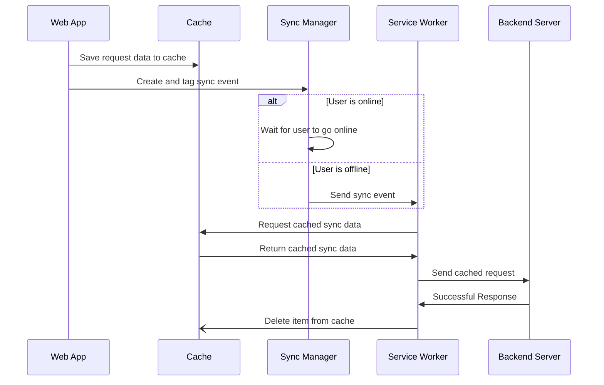
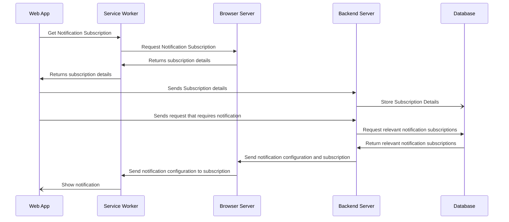

# PWA Key Concepts
## Summary
Progressive Web Apps (PWA) as the name implies are simply additions to web apps that can be added progressively. That is to say if they are not available the application would still work allowing for older browser functionality.

## Manifest
A manifest is used to describe our application to the browser. It allows us to state what name to use, icon, images etc. to be shown in different formats outside of the web app. This dictates the appearance should the user decide to download our application.

## Service Worker
The service worker is a proxy server that communicates between the web app, browser and network. That is to say it functions outside of the realm of these three and can work to communicate between the three in different ways.

## Cache
The cache is a storage space available to the service worker. This can be used to store things like stylesheets, html, javascript and more. However. having too many items stored can have an issue with performance and so it is recommended that you only store what is necessary for your application. This is why you might see applications where there is a static and a dynamic storage where static will store all of the basic files you application needs and dynamic stores items the user has interacted with.

## Background Sync
One of the advantages of a PWA is the ability to have your application continue working even when offline. We can show pages and some level of functionality while the user might not have access to the internet. In these case we can make use of the [Background Synchronization API](https://developer.mozilla.org/en-US/docs/Web/API/Background_Synchronization_API) and in particular the [Sync Manager](https://developer.mozilla.org/en-US/docs/Web/API/SyncManager) to log items we want to synchronize in the background at a point when the user is back online.

The process involves setting up our POST request through the service worker and using the `sync` event listener. When the application is meant to make the POST request instead of making the POST directly from the application, the application will instead store the request object in the cache and set up a `SyncManager` object and tag the request. The `SyncManager` will then fire the `sync` event immediately if the user is online or as soon as it detects the user has gone online. At this point the `sync` event listener is triggered and you can use the tags you set to differentiate between which sync event you are handling. You will still have access to the cache and the POST request that should be synced and can send all the items as needed from the Service Worker

## Push Notifications
Push notifications consist of two parts, the `push` and the `notification`.

The `notification` portion comes from the service worker/web app. This portion is simply the act of showing the notification and can be done with the [Notification API](https://developer.mozilla.org/en-US/docs/Web/API/notification). This allows a notification to appear based on the options that were passed to it. If the notification is shown from the web application it will only appear if the application is active and has the focus. However, since Service Workers live outside of the web application, a notification from them can be shown even if the web application is not active. Thus it would work best to allow the service worker to handle notifications.

The `push` portion has a variety of parts working. At the center of it all is the [Push API](https://developer.mozilla.org/en-US/docs/Web/API/Push_API). In order for this API to work we need an active service worker. The service worker is needed in order to create subscription for the push. This subscription will have the endpoint that needs to be called to send the notification to the service worker. It should be noted that each subscription is between the service worker and the browser. So subscribing to notifications from one browser does not mean you'll receive notifications from another browser on the same machine. 

When a server is attempting to send notifications out it will do so by pinging the an endpoint URL that is provided by the notification subscription. This is actually an endpoint on the web browser's server. Sending data to this endpoint will then send the event to the subscription which the service worker

At this point the service worker [push](https://developer.mozilla.org/en-US/docs/Web/API/ServiceWorkerGlobalScope/push_event) event will be triggered and executed. The service worker can work with the data passed in the notification details and use it create the desired notification.

### Notification Security
With the endpoint provided anyone can send notifications to the subscription, as such the best effort should be put in to keeping it hidden. However on top of this we can include keys to keep them protected. In the case for this POC you will see the use of Vapid to generate a public and private key. The public key can be visible and in fact will be used by the web app/service worker when creating the subscription for push notifications. The private key should be kept hidden and will be used by the backend server your application uses to eventually send a notification to the browser server. This adds a level of security to the endpoints and protects your users from receiving notifications from outside sources.

## Notification Interaction
Notifications lead to further interaction from users to your application. The service workers have listeners for these interaction to allow us to add any behavior we want our user to experience. We can listen to events where the user closes a notification or even clicks on it. We can use it to redirect the user back to the web app or additional actions that were not tried in the scope of this POC.

