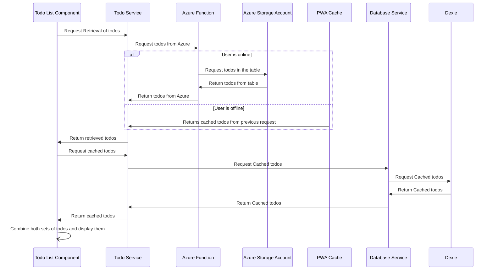
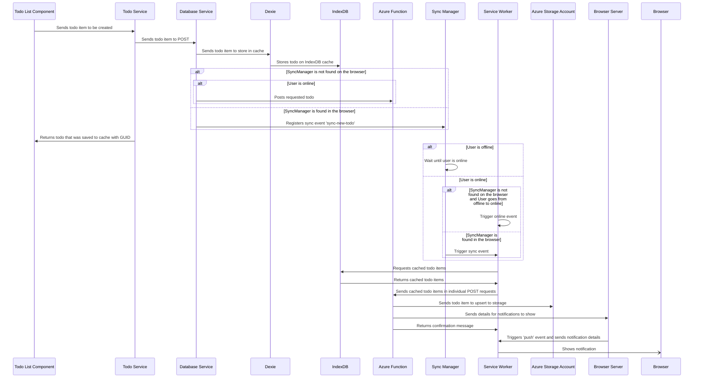
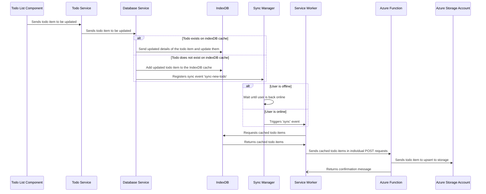
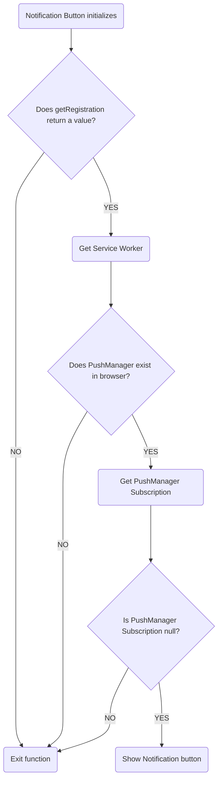

# Angular PWA POC

## About
Angular is a Single Page Application (SPA) framework. For the sake of this POC we are testing it's capabilities with PWA functionality. Angular itself has a command that can generate a service worker as well as any additional files needed to have basic PWA functionality. On top of this it also allows for customization and bringing in our own code and work.

## Setup before running
1. Ensure `TABLE_URL`, `ACCOUNT_NAME`, `ACCOUNT_KEY`, `PUBLIC_KEY` and `PRIVATE_KEY` values are set
  1. If running `locally` this may mean hard coding the values in the local Azure functions
  2. If running on the Azure static site set the values using the Azure portal and the static site resource
      1. `TABLE_URL`is the the url of the azure table. It should look something like this `https://{{TABLE_NAME}}.table.core.windows.net`
      2. `ACCOUNT_NAME` is the name of Azure Storage Account Resource. So the the name of the Azure resource hosting the table.
      3.  `ACCOUNT_KEY` can be found in the Azure portal under the storage account resource. `Security + networking` -> `Access Keys`. You will want to use one of the items labelled as `key`
      4. `PUBLIC_KEY` and `PRIVATE_KEY`: Are the keys you generated that will be use to secure notifications between all the parties involved. In this POC we made use of `web-push generate-vapid-keys` to create the public and private key
1. If static site has been deployed from scratch be sure to update the `AZURE_STATIC_WEB_APPS_API_TOKEN` repository key on GitHub with the new token.
1. The file `service-worker.js` has a variable `azureFunctionUrl` that needs to be updated to match the url you actuall want to hit.

## Running this application
1. Run `npm install`
2. Run `npm run start`
  * This will build the application with a production configuration that allows for the service worker to work alongside the angular served application and allow for the proxy configuration setup to interact with the azure endpoints.
  * This is the script for start
  * `"start": "ng serve --proxy-config proxy.config.json --configuration production"`
  * The angular application needs to be run in production because Angular's registration strategy for the service worker is only done in production mode
  * Note, if there is some jumpiness (the page loading non stop) you can unregister the service worker. It will then register itself on refresh. I think it might just be an issue of angular serve detecting the change but conflicting with the existing service worker. So un-registering updates the service worker as well.
  * Alternatively you can use `"ng build --configuration production && http-server -p 8080 -c-1 dist/angular-pwa"` in a separate script to build in production configuration and host the built file. This is a bit more stable but does lack the ability of using the proxy configuration for external endpoint calls

## Getting started with PWA in Angular
Angular has a command that can generate PWA functionality and start a foundation for adding these features.

Per the documentation from Angular found [here](https://angular.io/guide/service-worker-getting-started), we can run the following command to get started.  
`ng add @angular/pwa --project <project-name>`

This should make various changes including
* Adding `@angular/service-worker` package to the project
* Creates a `manifest.webmanifest` file
* Updating the index.html file to include the `manifest.webmanifest` file
* Updates the app.module to register a service worker that will be created when the angular application is built

## Explanation of files
### ngsw-config.json
* This is the angular service worker configuration file
* Most of the code in this file is generated when running the command for adding PWA Support to Angular 
* One customization that was added however is the `dataGroups` parameter
  *  `dataGroups`: allows you to store certain pieces of data in particular to the cache
  * The usage for it in this application is to store a response we get from the todos endpoint

#### Basic Breakdown of DataGroups
```json
"dataGroups": [
  {
    "name": string,
    "urls": string[],
    "version": number,
    "cacheConfig": {
      "maxSize": number,
      "maxAge": string,
      "timeout": string,
      "strategy": "freshness|performance"
    }
  }
]
```
* `name`: This is the name of the data group and used for organization purposes
* `urls`: This is meant to be a list of urls that are attached to the group. Calls to any url in the list will have the configurations applied to it. The service worker will on cache endpoint responses of `GET` and `HEAD`.
    * You can also list a prefix for example in the application `api/*` indicates that anything within the API prefix so `api/getList` and `api/getEntities` will be stored but not `getFeedback`
* `version`: A numerical representation of the version for this data group
* `cacheConfig`: Configuration for the cache of this data group
  * `maxSize`: The maximum number of entries allowed in the cache
  * `maxAge`: The maximum amount of time elements in the cache should be kept. This is written in string format 
    * Example `"14d12h"` stands for 14 days and 12 hours
  * `timeout`: The amount of time an endpoint call should attempt to complete the network call before timing out
  * `strategy`: Which strategy to use for this cache
    * `freshness`: Prefers getting data from the fetch request but on time out will fallback to the cache
    * `performance`: Optimized for fast response and will use the cache over a network call. This can cause some staleness based on the `maxAge` value.


### package.json
This should more or less stay the same with the addition of a script that builds the angular app and then hosts it on a server using the `http-server` package

`"start-pwa": "ng build --configuration production && http-server -p 8080 -c-1 dist/angular-pwa"`

### manifest.webmanifest
Another file auto generated by Angular CLI. This contains all the information on how to present the web app to the browser.

#### manifest.webmanifest breakdown
* `name`: This is the name of the web app and should the user download the app this will be the name they will see for it
* `short_name`: This is the name of the application to be used in text limited areas such as mobile devices
* `theme_color`: This will be a color used while the application is starting up if it has been downloaded
* `background_color`: Background color that will be used while the application is starting up if it has been downloaded
* `display`: This dictates how the downloaded web app should appear. Whether its similar to being a browser window or a native application
* `scope`: Represents the service worker's [scope](https://developer.mozilla.org/en-US/docs/Web/Manifest/scope)
* `start_url`: The root directory of the files involved in the web application
* `icons`: This is an array for the icons to be used. These icons will be used in the representations of the application in various devices
  * `src`: The location of the image to use
  * `sizes`: Dictates the dimensions of the provided image
  * `type`: The media type of the icon
  * `purpose`: What the icon can be used for


### ngsw-worker.js
This is the service worker that will be automatically generated by Angular on build. This will contain various functions that represent many PWA functionalities. However there are a few features missing and as such it is also possible to create your own service worker and import the generated script

### service-worker.js
This is a custom service worker that was created to implement the `sync` event. This allows for sending requests that may have been made while the user was offline but were stored until a moment when they are online.

This service worker imports the service worker generated by the angular CLI and build on top of it adding its own features.

This is a basic javascript service worker and can be modified and added to as needed. 


### db.ts
This was a file created to work with the `dexie` package. [Dexie](https://www.npmjs.com/package/dexie) is a library used for interacting with the IndexDB API. It is meant to simplify interactions with it. Here a structure is set up for table as well as the store that will hold one or more tables

In this case we provide the structure for `TodoSync` and initialize the store that will hold the TodoSync values

### service-worker-utility
This folder contains additional javascript script to be used by the service worker. In particular these files are used to connect the service worker to the same store created by dexie on the Angular end. This allows the service worker to interact with the table and make any changes it needs.

In the case of this example for background sync the service worker uses the utility files to read from indexDB to get the objects its should send to the backend and then uses the utilities to delete the item from indexDB once it is done

## Functionality Diagrams

### Get Todos
Getting todos requires that we not only retrieve todos from the backend but also retrieve any todo items that may have been cached due to the user being offline.

The process for this involves the application making a request to the endpoint that provides the todo items. If the user is online then the process should go through the usual steps of grabbing from the Azure Storage Account and returning the todo items. 

If the user is offline however or if there is an error with the endpoint it will instead try to pull from the PWA cache it may have created from a previous page load. These values will instead be returned rather than values from the endpoint.

Once the values from the backend have been retrieved we still need to check for any todo items that were stored to the cache locally. This is because users can create a todo while offline and if the user refreshes the page it will be lost since it will not be retrieved during the endpoint call. As such the application then makes a call to the cache for any todo items that were stored there. 

Once both sets of todo items are gathered the application will combine them into a single todo list and that is what will be displayed by the application



### POST Todos
Post has been implemented in a way that allows for background sync. This involves making use of the service worker and the cache.

When a todo is being created the process it goes through involves saving the item to the IndexDB cache and using the sync manager to create a sync event

In order to reflect this change we also add this to the local todo list so the user can still see and interact the newly created item even if it has not been created in the backend just yet. 

On the service worker side it will be listening to the `sync` event which listens for the sync event we created which will only be triggered if the use is online.

When this event is triggered it will grab the todo items stored in the IndexDB cache and create a POST request for all of them.

On the Azure function side we will check if they already exist since the endpoint functions as update and create.

For these steps we assume the item does not exist and as such it is created on the Azure Storage Account Table

That is the process of creating a todo item

One additional note is that not all browsers are compatible with these functionalities. In this case the workaround involves some changes in the steps. Instead of creating a sync object the application will instead try to POST directly. If the user is offline then the service worker has an `online` event listener which triggers when the user goes from offline to online. This is what will complete the background sync event in cases where there are browser incompatibilities.



### Update Todos
Updating todo has also been implemented in a way that allows for background sync meaning users can choose to update a todo while offline and the backend will reflect these changes once they are online.

When user updates a todo, in this case clicks on the checkbox next to the item the database service will handle the process.

It will check if the item being updated currently exists on IndexDB. This would mean that the todo item that is being updated is currently stored offline and will be sent to the backend once user is back online

However if the item does not exist then it will save the todo item with the new details to the IndexDB cache which will be sent out once the user is back online.

In both cases a sync event will be created.

When the user is online the sync event will trigger on the Service worker side and it will upsert the item. This means if the item already exists (meaning the item is already on the table and we are updating) the item will be updated, however if the item is new (meaning it doesn't exist on the table yet) it will be inserted to the table

For the focus of this we will assume the item is being updated in which case notifications will not be sent out.




### Notification Subscription
Push notifications requires using the service worker and its `PushManager` api to create a subscription between the Service Worker and Browser. Once the subscription is made an endpoint is provided that can be passed to the backend and used to send out push notifications to the subscriptions.

That said `PushManager` is unfortunately not something in all browsers as of the writing of this report. In particular the example found was that this api is only available to MacOS 13 or later as well as iOS 16.4 or later. Versions before this will simply not have the `Push Manager` which is a necessity for push notification functionality. For the sake of this POC a guard clause was added to prevent trying to set up push notifications when it is not compatible with the browser.




## Compatibility notes
Progressive web app functionalities are still not compatible with all browsers/OSs. As such in some cases the best thing to do is implement fallbacks for these scenarios.

During the creation of this POC it was found that `SyncManager` is not found in Safari. The work around for this involved checking users browser for `SyncManager` if it wasn't found the web app would instead try to post directly instead of from the service worker and in cases where the user is offline an event listener has been added to the service worker for the transition from offline to online.

Another compatibility note is that `PushManager` is not available on older versions of iOS and as such the push notification functionality is not available on these older iOS versions. Unfortunately the only action that could have been done in this case was to put a guard to see if `PushManager` is available to avoid any errors from trying to get the functionality when it isn't possible. When PushManager is available on iOS it will only be on app the user has added to their home screen. Visiting the page on the safari app will not allow for notifications.

[Stack Overflow where I found this](https://stackoverflow.com/questions/76222241/safari-on-ios16-4-creates-a-serviceworker-without-pushmanager-why)

[Apple Documentation on Push Notification](https://developer.apple.com/documentation/usernotifications/sending_web_push_notifications_in_web_apps_and_browsers)

Key Bit

Add web push to Home Screen web apps in iOS 16.4 or later and Webpages in Safari 16 for macOS 13 or later.
